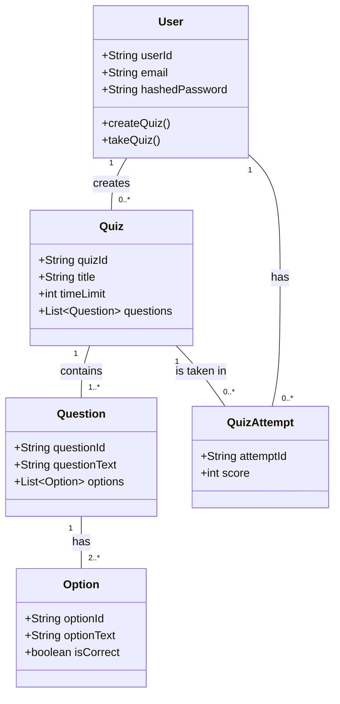
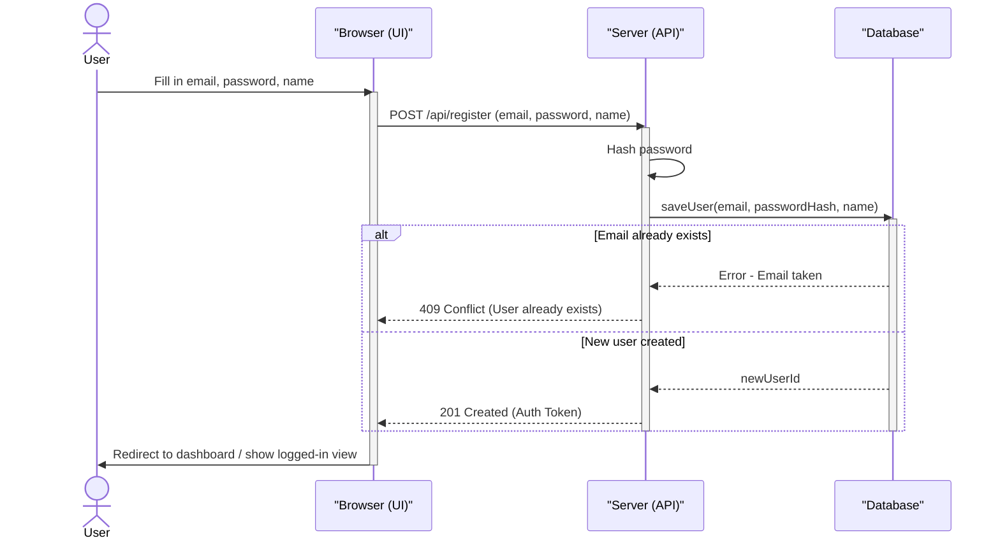
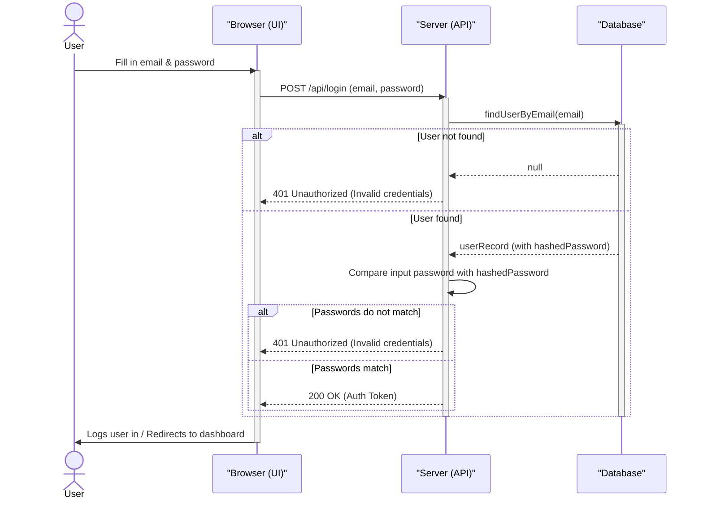
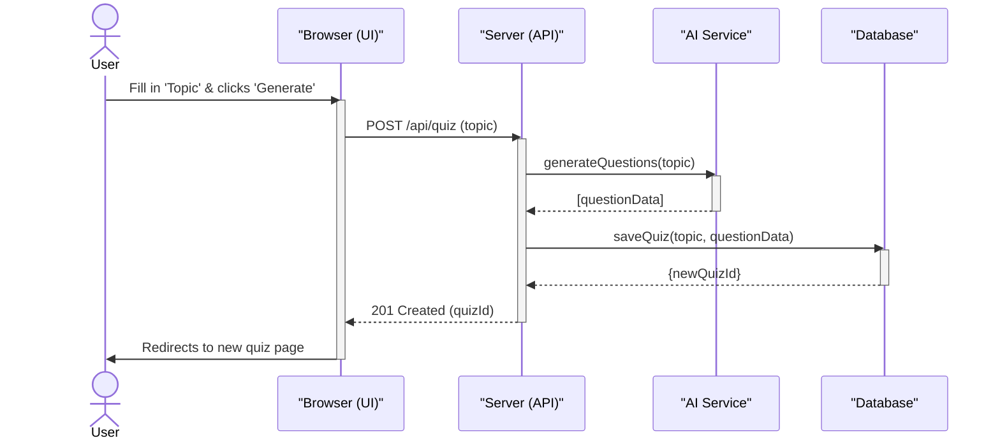
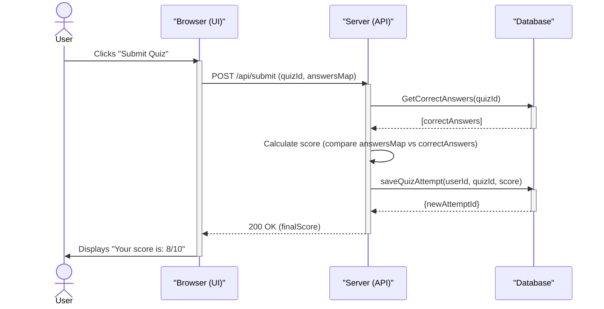
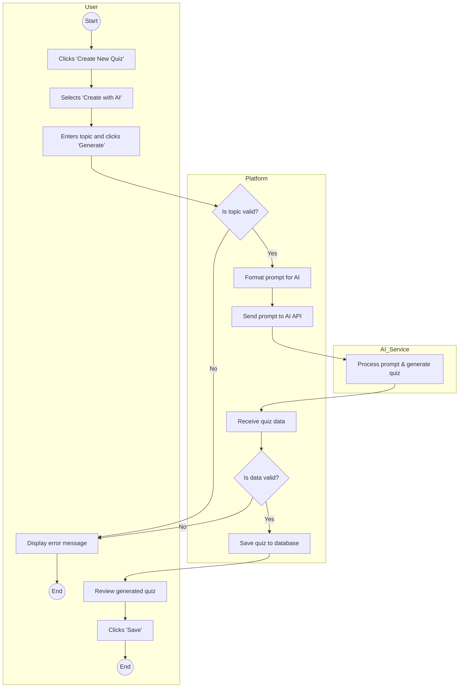
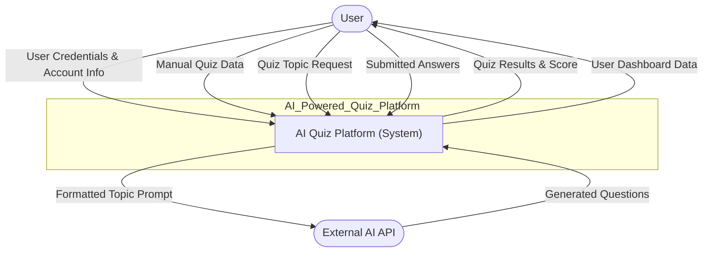
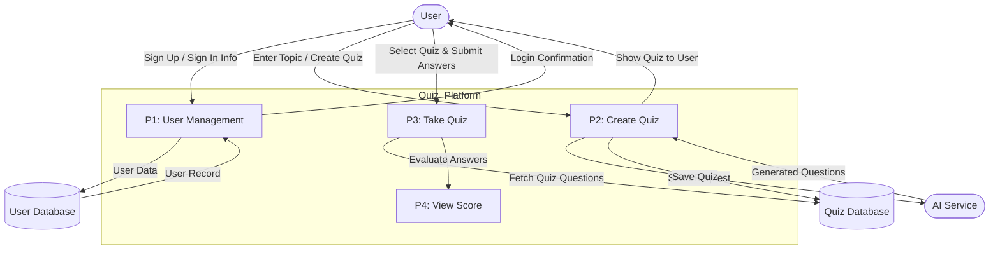
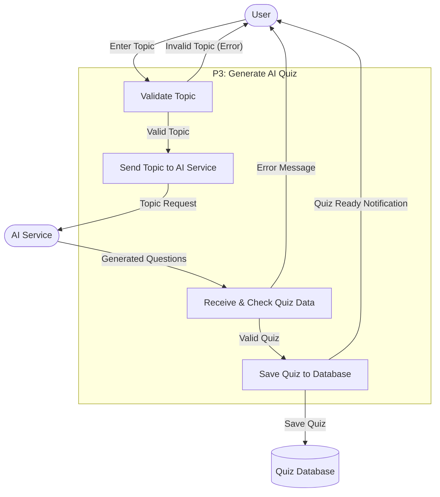
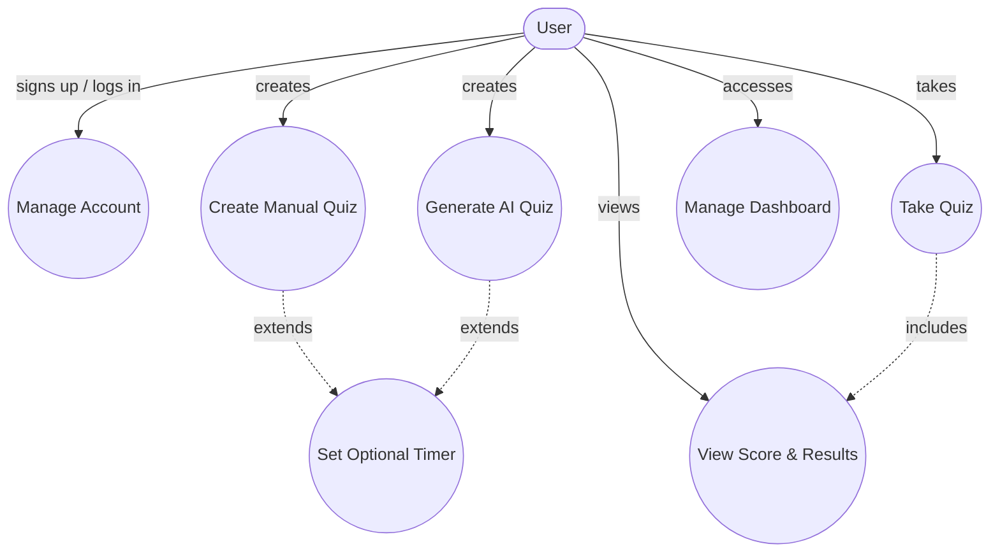

This project is an AI-Powered Quiz Platform designed to make learning, training, and self-assessment simple and engaging. It allows users to create, share, and take quizzes with ease. The standout feature is an AI assistant that can automatically generate quiz questions on any given topic, streamlining the quiz creation process for educators, students, and businesses.




##  Sequence Diagram: User Sign Up



---

##  Sequence Diagram: User Sign In



---

## Sequence Diagram: Create AI Quiz



---

##  Sequence Diagram: Submit Quiz & See Score



---

## Activity Diagram: Create AI Quiz


##  Data Flow Diagram (Level 0)



##  Data Flow Diagram (Level 1)


## DFD (Level 2)


##  Use Case Diagram – AI Quiz Platform



    P4 -- "Final Score" --> User
```
