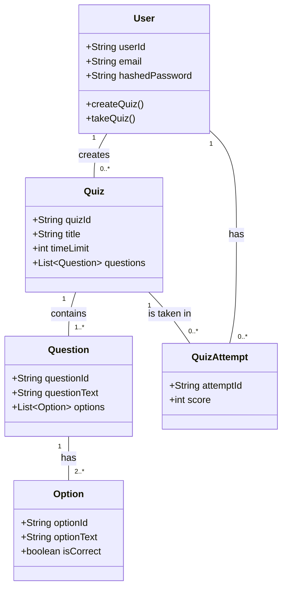
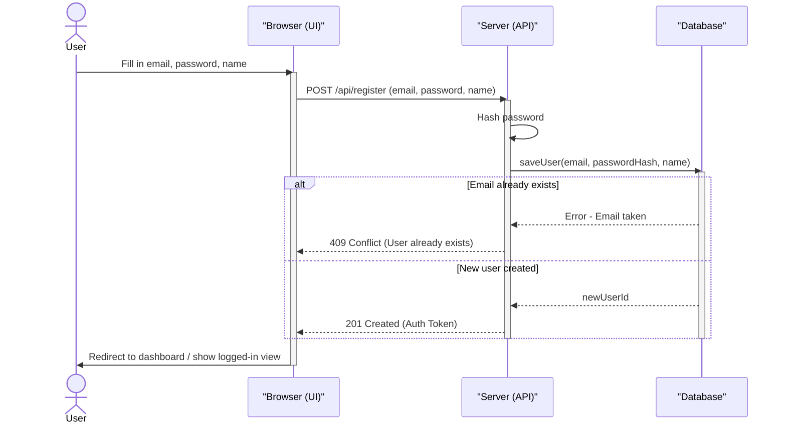
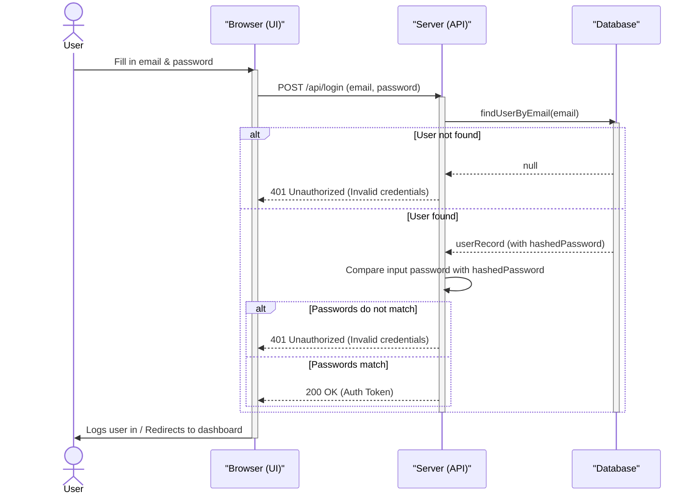
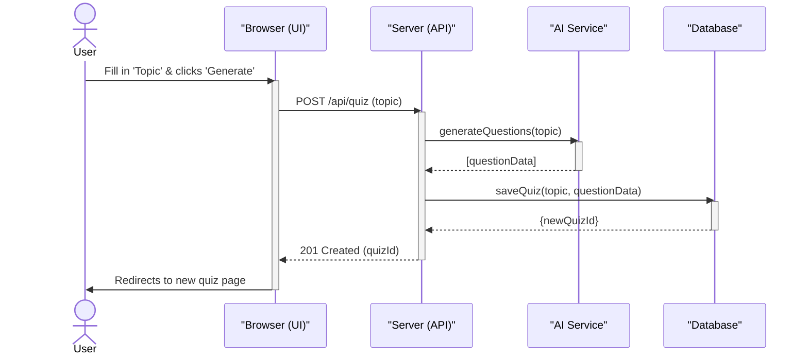
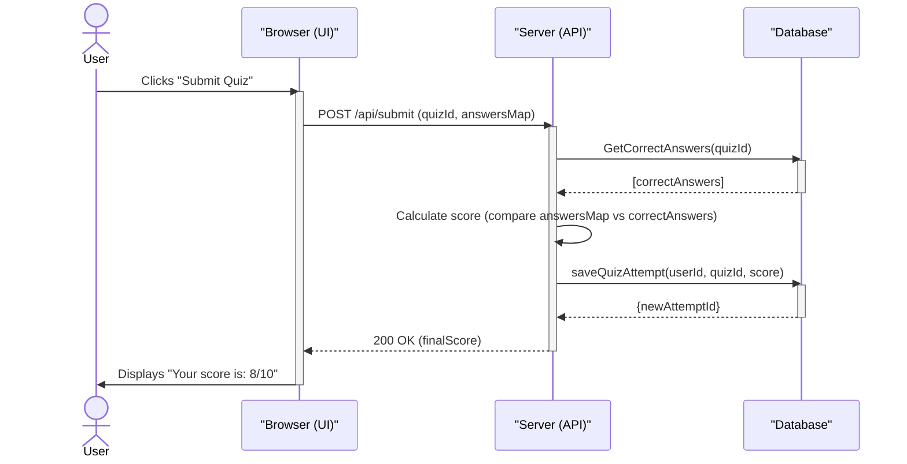
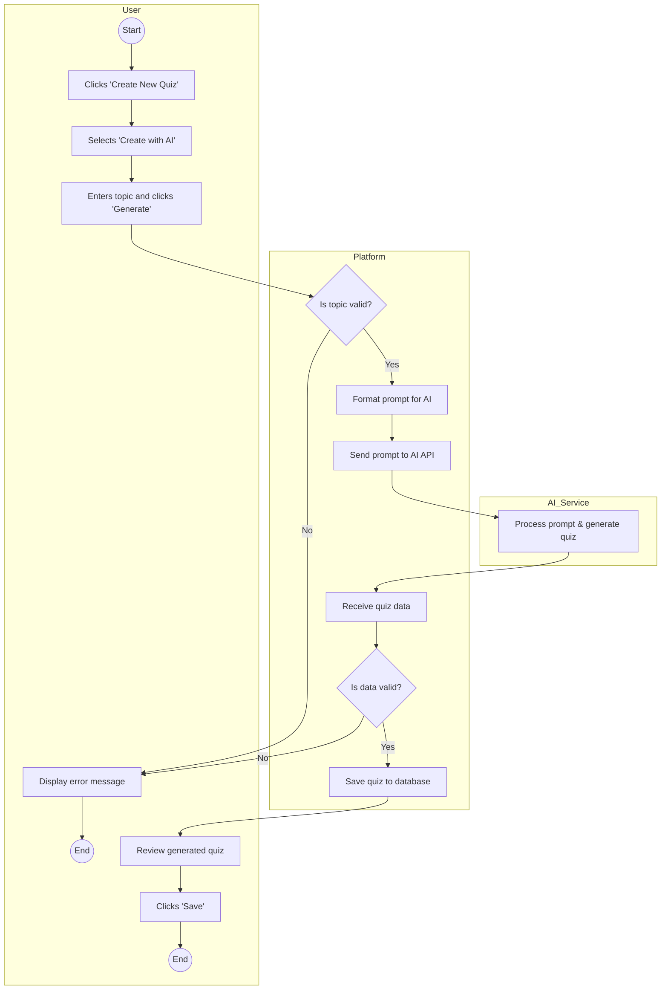
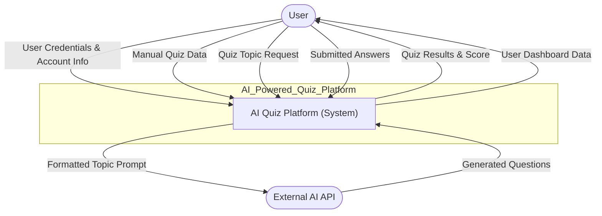
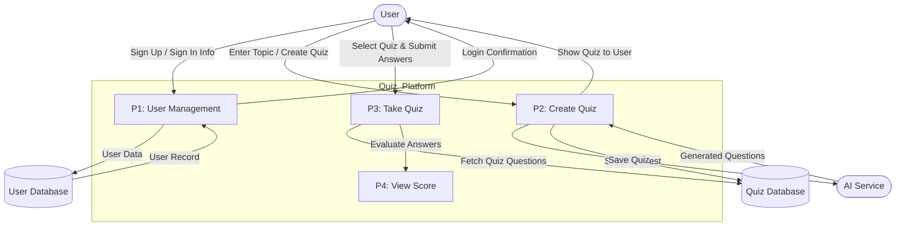
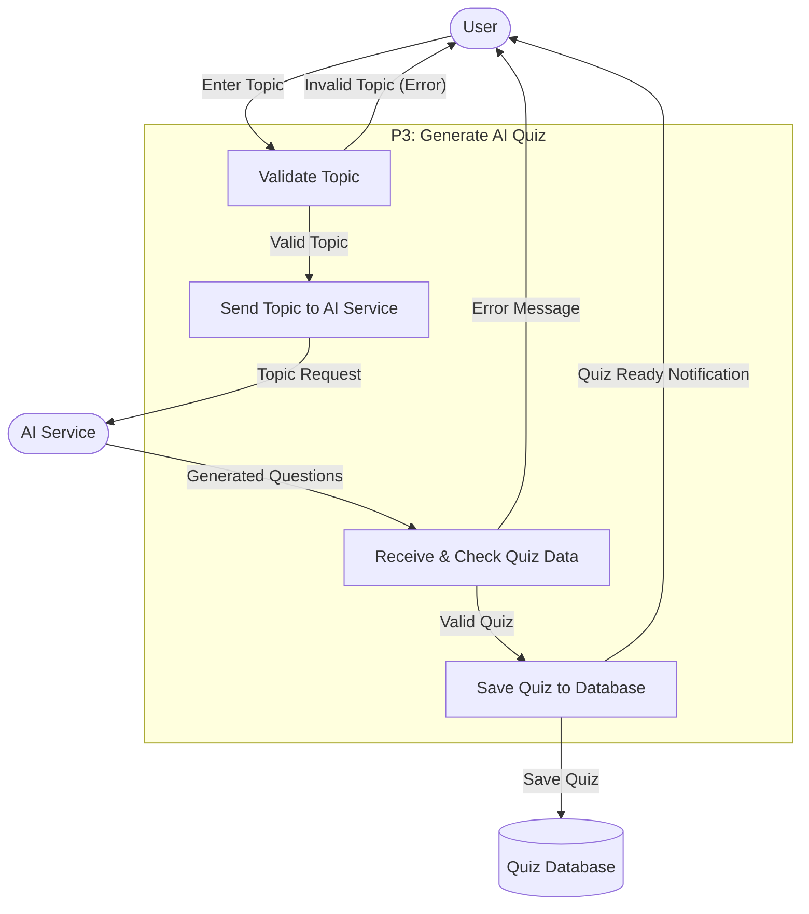
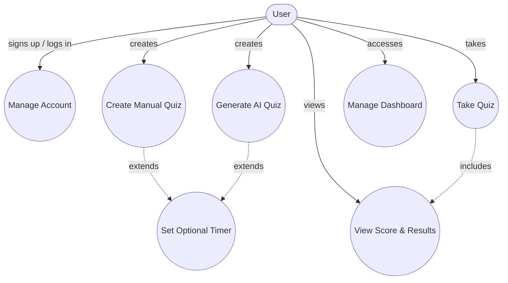

# AI-Powered Quiz Platform

This project is an AI-Powered Quiz Platform designed to make learning, training, and self-assessment simple and engaging. It allows users to create, share, and take quizzes with ease. The standout feature is an AI assistant that can automatically generate quiz questions on any given topic, streamlining the quiz creation process for educators, students, and businesses.

## Features

- 🤖 **AI-Powered Quiz Generation**: Automatically generate quiz questions on any topic using Google Gemini AI
- ✏️ **Manual Quiz Creation**: Build custom quizzes with full control over questions and answers
- 📊 **Real-time Dashboard**: View and manage all your quizzes in real-time with Firebase integration
- 🎯 **Interactive Quiz Taking**: Take quizzes with a clean, user-friendly interface
- 🔐 **Secure Authentication**: Powered by Clerk for secure user authentication and management
- 🎨 **Beautiful UI**: Modern black and gold themed interface built with Tailwind CSS and Shadcn UI
- 📱 **Responsive Design**: Works seamlessly across desktop and mobile devices
- 🧪 **End-to-End Testing**: Comprehensive Cypress tests for critical user journeys

## Tech Stack

### Frontend
- **React 19** - UI library
- **TypeScript** - Type safety
- **Vite** - Build tool and dev server
- **React Router DOM** - Client-side routing
- **Tailwind CSS** - Utility-first CSS framework
- **Shadcn UI** - Reusable component library
- **TanStack Query** - Data fetching and caching

### Backend & Services
- **Clerk** - Authentication and user management
- **Firebase Firestore** - Real-time database
- **Firebase Auth** - Authentication (synced with Clerk)
- **Vercel Serverless Functions** - Secure API endpoints

### AI & Testing
- **Google Gemini API** - AI quiz generation
- **Cypress** - End-to-end testing framework

## Prerequisites

Before you begin, ensure you have the following installed:
- **Node.js** (v18 or higher)
- **pnpm** (v8.10.0 or higher) - Package manager
- **Git** - Version control

You'll also need accounts for:
- **Clerk** - [Sign up here](https://clerk.com)
- **Firebase** - [Sign up here](https://firebase.google.com)
- **Google Cloud** - For Gemini API access
- **Vercel** (optional) - For deployment

## Installation

1. **Clone the repository**
   ```bash
   git clone <your-repo-url>
   cd my-quiz
   ```

2. **Install dependencies**
   ```bash
   pnpm install
   ```

3. **Set up environment variables**
   
   Create a `.env` file in the root directory:
   ```env
   VITE_CLERK_PUBLISHABLE_KEY=your_clerk_publishable_key
   VITE_FIREBASE_CONFIG='{"apiKey":"...","authDomain":"...","projectId":"...","storageBucket":"...","messagingSenderId":"...","appId":"...","measurementId":"..."}'
   ```
   
   For production deployment on Vercel, also add:
   ```env
   GEMINI_API_KEY=your_gemini_api_key
   ```

## Environment Variables

### Client-Side Variables (`.env`)
- `VITE_CLERK_PUBLISHABLE_KEY` - Your Clerk publishable key (get it from your Clerk dashboard)
- `VITE_FIREBASE_CONFIG` - Firebase configuration as a JSON string

### Server-Side Variables (Vercel Dashboard)
- `GEMINI_API_KEY` - Your Google Gemini API key (used in serverless function)

**Important**: The `.env` file is gitignored to prevent accidental exposure of sensitive keys. Never commit API keys to version control.

## Running the Project

### Development Server
```bash
pnpm dev
```
The app will be available at `http://localhost:5173` (or the port shown in terminal).

### Build for Production
```bash
pnpm build
```

### Preview Production Build
```bash
pnpm preview
```

### Linting
```bash
pnpm lint
```

## Testing

This project includes comprehensive end-to-end tests using Cypress.

### Running Cypress Tests

1. **Start the development server** (in one terminal):
   ```bash
   pnpm dev
   ```

2. **Run Cypress** (in another terminal):
   ```bash
   npx cypress open
   ```
   Or run headless:
   ```bash
   npx cypress run
   ```

### Test Suites

- **`cypress/e2e/navigation.cy.ts`** - Tests basic navigation and authentication redirects
- **`cypress/e2e/full_journey.cy.ts`** - Complete user journey: sign-up, manual quiz creation, taking quiz, and deletion
- **`cypress/e2e/ai_journey.cy.ts`** - AI quiz generation journey: sign-up, AI quiz creation, and deletion

**Note**: Ensure your development server is running on `http://localhost:3000` (as configured in `cypress.config.ts`).

## Project Structure

```
my-quiz/
├── api/                    # Vercel serverless functions
│   └── generate-quiz.ts   # AI quiz generation endpoint
├── cypress/               # E2E tests
│   ├── e2e/              # Test files
│   └── config.ts         # Cypress configuration
├── public/                # Static assets
├── src/
│   ├── components/        # React components
│   │   ├── ui/          # Shadcn UI components
│   │   └── Navbar.tsx   # Navigation component
│   ├── hooks/            # Custom React hooks
│   ├── lib/              # Utility libraries
│   │   ├── firebase.ts  # Firebase initialization
│   │   ├── auth.ts      # Auth utilities
│   │   └── utils.ts     # General utilities
│   ├── pages/            # Page components
│   │   ├── Home.tsx     # Landing page
│   │   ├── Dashboard.tsx # User dashboard
│   │   ├── CreateQuizAI.tsx # AI quiz creation
│   │   ├── CreateQuizManual.tsx # Manual quiz creation
│   │   ├── QuizTaker.tsx # Quiz taking interface
│   │   └── NotFound.tsx  # 404 page
│   ├── App.tsx           # Main app component with routing
│   ├── main.tsx          # Application entry point
│   └── index.css         # Global styles
├── .env                  # Environment variables (gitignored)
├── .gitignore           # Git ignore rules
├── package.json         # Dependencies and scripts
├── tailwind.config.ts   # Tailwind configuration
└── vite.config.ts       # Vite configuration
```

## API Endpoints

### `/api/generate-quiz` (Serverless Function)

**Method**: POST

**Description**: Securely generates quiz questions using Google Gemini AI. The API key is kept server-side to prevent exposure.

**Request Body**:
```json
{
  "userPrompt": "Create a quiz about JavaScript",
  "systemPrompt": "You are a quiz generator..."
}
```

**Response**:
```json
{
  "text": "Generated quiz content..."
}
```

**Error Responses**:
- `405` - Method not allowed
- `400` - Missing required prompts
- `500` - API key not configured or generation failed

## Deployment

### Deploying to Vercel

1. **Push your code to GitHub**

2. **Import project in Vercel**
   - Go to [Vercel Dashboard](https://vercel.com)
   - Click "New Project"
   - Import your GitHub repository

3. **Configure Environment Variables**
   - In Vercel project settings, add:
     - `VITE_CLERK_PUBLISHABLE_KEY`
     - `VITE_FIREBASE_CONFIG`
     - `GEMINI_API_KEY` (server-side only)

4. **Deploy**
   - Vercel will automatically detect Vite and deploy
   - The serverless function in `/api` will be automatically deployed

### Security Checklist

- ✅ `.env` file is in `.gitignore`
- ✅ API keys are never committed to version control
- ✅ Gemini API key is server-side only (in Vercel environment variables)
- ✅ Firebase config uses environment variables
- ✅ Clerk publishable key is safe to expose (it's designed for client-side use)

## Data Model




##  Sequence Diagram: User Sign Up



---

##  Sequence Diagram: User Sign In



---

## Sequence Diagram: Create AI Quiz



---

##  Sequence Diagram: Submit Quiz & See Score



---

## Activity Diagram: Create AI Quiz


##  Data Flow Diagram (Level 0)



##  Data Flow Diagram (Level 1)


## DFD (Level 2)


##  Use Case Diagram – AI Quiz Platform




